# RepairPro - Project Structure Documentation

## Table of Contents
- [Architecture Overview](#architecture-overview)
- [Directory Structure](#directory-structure)
- [Component Hierarchy](#component-hierarchy)
- [Data Flow](#data-flow)
- [Technology Stack](#technology-stack)

## Architecture Overview

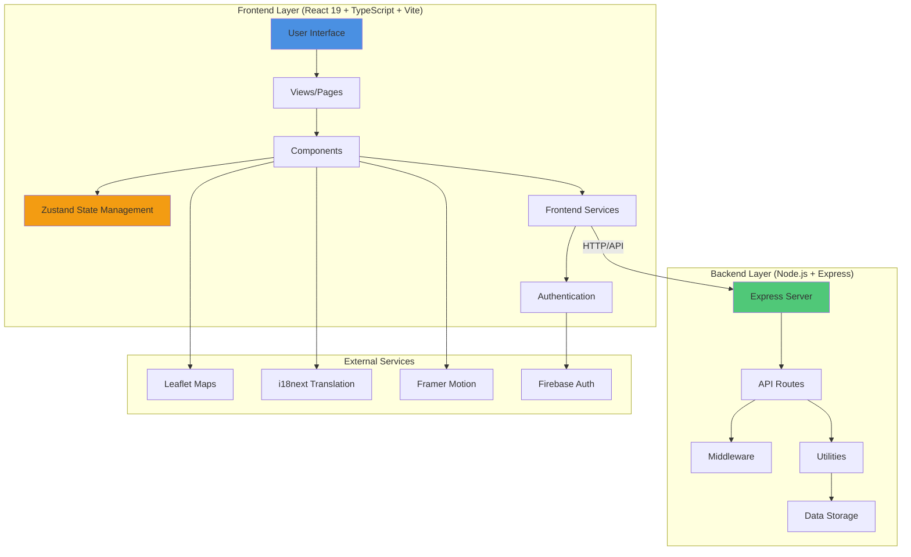

## Directory Structure

### Root Level
```
Ecme-lite-cesar/
├── backend/              # Node.js/Express backend server
├── src/                  # React frontend application
├── public/               # Static assets
├── .devcontainer/        # Development container config
├── .github/              # GitHub workflows and configs
├── .vscode/              # VSCode settings
├── package.json          # Frontend dependencies
├── vite.config.ts        # Vite configuration
├── tailwind.config.cjs   # Tailwind CSS config
├── tsconfig.json         # TypeScript config
└── [Documentation files] # Various MD files
```

### Frontend Structure (`src/`)

```mermaid
graph LR
    subgraph "Frontend (src/)"
        A[@types] --> B[Type Definitions]
        C[assets] --> D[Styles & Images]
        E[auth] --> F[Authentication Logic]
        G[components] --> H[UI Components]
        I[configs] --> J[App Configuration]
        K[constants] --> L[App Constants]
        M[data] --> N[Static Data]
        O[locales] --> P[Translations]
        Q[mock] --> R[Mock Data/API]
        S[services] --> T[API Services]
        U[store] --> V[Zustand Stores]
        W[utils] --> X[Utilities & Hooks]
        Y[views] --> Z[Page Components]
    end
    
    style G fill:#e74c3c
    style S fill:#3498db
    style U fill:#f39c12
    style Y fill:#9b59b6
```

#### Detailed Component Structure

```
src/
├── @types/              # TypeScript type definitions
│   ├── auth.ts
│   ├── common.tsx
│   ├── docs.ts
│   ├── navigation.ts
│   ├── routes.tsx
│   ├── services.ts
│   └── theme.ts
│
├── assets/              # Static assets and global styles
│   └── styles/
│       ├── components/
│       ├── tailwind/
│       ├── template/
│       ├── vendors/
│       └── app.css
│
├── auth/                # Authentication system
│   ├── AuthContext.ts
│   ├── AuthProvider.tsx
│   ├── useAuth.ts
│   └── index.ts
│
├── components/          # Reusable React components
│   ├── layouts/        # Layout components
│   │   ├── AuthLayout/
│   │   ├── PostLoginLayout/
│   │   ├── PreLoginLayout.tsx
│   │   ├── Layouts.tsx
│   │   └── index.ts
│   │
│   ├── route/          # Route components
│   │   ├── AllRoutes.tsx
│   │   ├── AppRoute.tsx
│   │   ├── AuthorityGuard.tsx
│   │   ├── ProtectedRoute.tsx
│   │   └── PublicRoute.tsx
│   │
│   ├── shared/         # Shared components
│   │   ├── Chatbot/
│   │   ├── HeaderExtras/
│   │   ├── ActionLink.tsx
│   │   ├── AuthorityCheck.tsx
│   │   ├── Container.tsx
│   │   ├── HealthStatus.tsx
│   │   ├── Loading.tsx
│   │   ├── NavToggle.tsx
│   │   ├── PasswordInput.tsx
│   │   └── index.tsx
│   │
│   ├── template/       # Template components
│   │   ├── VerticalMenuContent/
│   │   ├── Footer.tsx
│   │   ├── Header.tsx
│   │   ├── HeaderLogo.tsx
│   │   ├── LayoutBase.tsx
│   │   ├── Logo.tsx
│   │   ├── MobileNav.tsx
│   │   ├── PageContainer.tsx
│   │   ├── SideNav.tsx
│   │   ├── SideNavToggle.tsx
│   │   ├── SimpleHeader.tsx
│   │   ├── Theme.tsx
│   │   └── UserProfileDropdown.tsx
│   │
│   └── ui/             # UI primitive components
│       ├── Alert/
│       ├── Avatar/
│       ├── Button/
│       ├── CloseButton/
│       ├── ConfigProvider/
│       ├── Drawer/
│       ├── Dropdown/
│       ├── Form/
│       ├── Input/
│       ├── InputGroup/
│       ├── Menu/
│       ├── MenuItem/
│       ├── ScrollBar/
│       ├── Spinner/
│       ├── StatusIcon/
│       ├── Tooltip/
│       ├── hooks/
│       ├── utils/
│       └── index.ts
│
├── configs/             # Configuration files
│   ├── navigation.config/
│   │   └── index.ts
│   ├── routes.config/
│   │   ├── authRoute.ts
│   │   ├── routes.config.ts
│   │   └── index.ts
│   ├── app.config.ts
│   ├── endpoint.config.ts
│   ├── navigation-icon.config.tsx
│   └── theme.config.ts
│
├── constants/           # Application constants
│   ├── api.constant.ts
│   ├── app.constant.ts
│   ├── navigation.constant.ts
│   ├── roles.constant.ts
│   ├── route.constant.ts
│   └── theme.constant.ts
│
├── data/                # Static data
│   └── services.data.ts
│
├── locales/             # Internationalization
│   ├── lang/
│   │   ├── en.json
│   │   └── es.json
│   ├── index.ts
│   └── locales.ts
│
├── mock/                # Mock data and API
│   ├── data/
│   │   ├── authData.ts
│   │   └── commonData.ts
│   ├── fakeApi/
│   │   └── authFakeApi.ts
│   ├── MockAdapter.ts
│   └── index.ts
│
├── services/            # API service layer
│   ├── axios/
│   │   ├── AxiosBase.ts
│   │   ├── AxiosRequestIntrceptorConfigCallback.ts
│   │   └── AxiosResponseIntrceptorErrorCallback.ts
│   ├── AgentService.ts
│   ├── ApiService.ts
│   ├── AuthService.ts
│   ├── HealthService.ts
│   ├── OAuthServices.ts
│   ├── WorkerService.ts
│   └── stream.ts
│
├── store/               # Zustand state management
│   ├── authStore.ts
│   ├── cartStore.ts
│   ├── currencyStore.ts
│   ├── localeStore.ts
│   ├── routeKeyStore.ts
│   └── themeStore.ts
│
├── utils/               # Utility functions and hooks
│   ├── hoc/
│   │   └── withHeaderItem.tsx
│   ├── hooks/
│   │   ├── useAuthority.ts
│   │   ├── useDarkMode.ts
│   │   ├── useDirection.ts
│   │   ├── useHealthCheck.ts
│   │   ├── useLayout.ts
│   │   ├── useLocale.ts
│   │   ├── useMenuActive.ts
│   │   ├── useResponsive.ts
│   │   ├── useTimeOutMessage.ts
│   │   └── useTranslation.ts
│   ├── classNames.ts
│   ├── cookiesStorage.ts
│   └── rbac.ts
│
├── views/               # Page components/views
│   ├── about/
│   │   ├── AboutUs.tsx
│   │   └── index.ts
│   ├── admin/
│   │   ├── AdminDashboard.tsx
│   │   ├── WorkerManagement.tsx
│   │   └── index.ts
│   ├── auth/
│   │   ├── ForgotPassword/
│   │   ├── ResetPassword/
│   │   ├── SignIn/
│   │   └── SignUp/
│   ├── cart/
│   │   ├── Cart.tsx
│   │   └── index.ts
│   ├── contact/
│   │   ├── Contact.tsx
│   │   └── index.ts
│   ├── demo/            # Demo views for menu components
│   ├── enterprise/
│   │   ├── Enterprise.tsx
│   │   └── index.ts
│   ├── feedback/
│   │   ├── Feedback.tsx
│   │   └── index.ts
│   ├── inventory/
│   │   ├── Inventory.tsx
│   │   └── index.ts
│   ├── quote/
│   │   ├── Quote.tsx
│   │   └── index.ts
│   ├── services/
│   │   ├── Services.tsx
│   │   └── index.ts
│   ├── workers/
│   │   ├── Workers.tsx
│   │   └── index.ts
│   ├── Home.tsx
│   ├── Views.tsx
│   └── index.tsx
│
├── App.tsx              # Main App component
├── main.tsx             # Application entry point
├── index.css            # Global styles
└── vite-env.d.ts        # Vite type definitions
```

### Backend Structure (`backend/`)

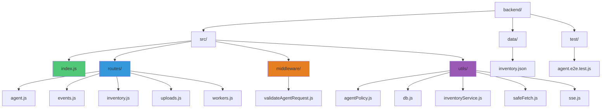

#### Detailed Backend Structure

```
backend/
├── src/
│   ├── index.js         # Express server entry point
│   │
│   ├── routes/          # API route handlers
│   │   ├── agent.js     # Agent proxy endpoint
│   │   ├── events.js    # Server-Sent Events
│   │   ├── inventory.js # Inventory management
│   │   ├── uploads.js   # File upload handling
│   │   └── workers.js   # Worker management
│   │
│   ├── middleware/      # Express middleware
│   │   └── validateAgentRequest.js
│   │
│   └── utils/           # Utility functions
│       ├── agentPolicy.js      # Agent security policies
│       ├── db.js               # Database utilities
│       ├── inventoryService.js # Inventory service
│       ├── safeFetch.js        # Secure fetch wrapper
│       └── sse.js              # SSE utilities
│
├── data/                # Data storage
│   └── inventory.json
│
├── test/                # Backend tests
│   └── agent.e2e.test.js
│
├── package.json         # Backend dependencies
├── eslint.config.mjs    # ESLint configuration
└── README.md            # Backend documentation
```

## Component Hierarchy

```mermaid
graph TD
    App[App.tsx] --> Router[React Router]
    Router --> PreLogin[PreLoginLayout]
    Router --> PostLogin[PostLoginLayout]
    Router --> AuthLayout[AuthLayout]
    
    PreLogin --> Home[Home Page]
    PreLogin --> Services[Services Page]
    PreLogin --> About[About Page]
    PreLogin --> Contact[Contact Page]
    
    PostLogin --> Dashboard[Admin Dashboard]
    PostLogin --> Workers[Worker Management]
    PostLogin --> Inventory[Inventory Management]
    PostLogin --> Cart[Shopping Cart]
    PostLogin --> Quote[Quote Requests]
    PostLogin --> Feedback[Feedback System]
    PostLogin --> Enterprise[Enterprise Features]
    
    AuthLayout --> SignIn[Sign In]
    AuthLayout --> SignUp[Sign Up]
    AuthLayout --> ForgotPw[Forgot Password]
    AuthLayout --> ResetPw[Reset Password]
    
    PostLogin --> Header[Header]
    PostLogin --> SideNav[Side Navigation]
    PostLogin --> Footer[Footer]
    
    Header --> UserProfile[User Profile Dropdown]
    Header --> HealthStatus[Health Status]
    Header --> Chatbot[Chatbot]
    
    SideNav --> VerticalMenu[Vertical Menu Content]
    
    style App fill:#e74c3c
    style PostLogin fill:#3498db
    style PreLogin fill:#2ecc71
    style AuthLayout fill:#f39c12
```

## Data Flow

### Authentication Flow
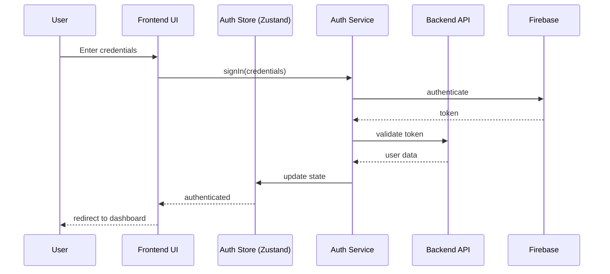

### Service Request Flow
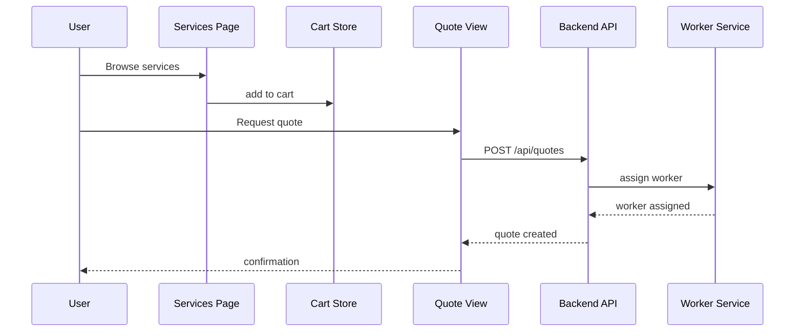

### Worker Location Flow
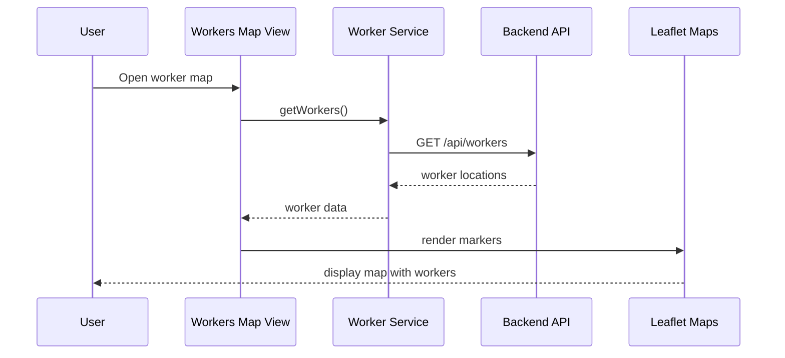

### Inventory Management Flow
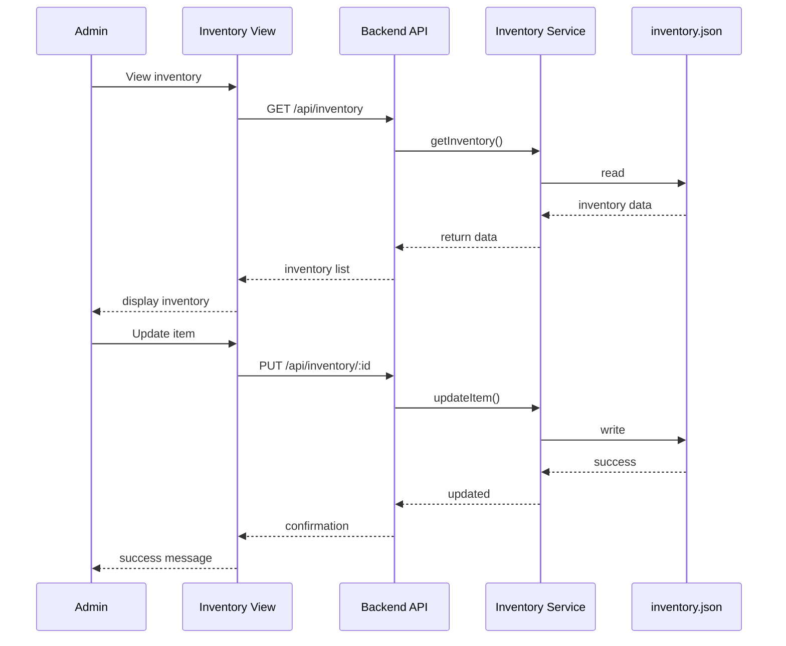

## Technology Stack

### Frontend Stack
```mermaid
graph LR
    subgraph "Core"
        React[React 19]
        TS[TypeScript]
        Vite[Vite 6]
    end
    
    subgraph "Styling"
        Tailwind[Tailwind CSS 4]
        Motion[Framer Motion]
    end
    
    subgraph "State & Data"
        Zustand[Zustand]
        Axios[Axios]
        SWR[SWR]
    end
    
    subgraph "Features"
        i18next[i18next]
        Leaflet[Leaflet]
        RHF[React Hook Form]
        Firebase[Firebase]
    end
    
    React --> TS
    TS --> Vite
    React --> Tailwind
    React --> Motion
    React --> Zustand
    React --> Axios
    Axios --> SWR
    React --> i18next
    React --> Leaflet
    React --> RHF
    React --> Firebase
    
    style React fill:#61dafb
    style TS fill:#3178c6
    style Tailwind fill:#38bdf8
    style Zustand fill:#443e38
```

### Backend Stack
```mermaid
graph LR
    subgraph "Runtime & Framework"
        Node[Node.js]
        Express[Express]
    end
    
    subgraph "Data & Storage"
        JSON[JSON Files]
        FS[File System]
    end
    
    subgraph "Features"
        SSE[Server-Sent Events]
        CORS[CORS]
        Agent[Agent Proxy]
    end
    
    Node --> Express
    Express --> JSON
    Express --> FS
    Express --> SSE
    Express --> CORS
    Express --> Agent
    
    style Node fill:#68a063
    style Express fill:#000000
```

## Key Features by Module

### 1. Authentication (`src/auth/`)
- Firebase authentication integration
- JWT token management
- Protected route handling
- Role-based access control (RBAC)

### 2. Service Management (`src/views/services/`)
- Service catalog display
- Service selection and cart management
- Quote request system
- Inspection scheduling

### 3. Worker Management (`src/views/workers/`, `backend/src/routes/workers.js`)
- Real-time worker location tracking
- Interactive map with Leaflet
- Worker availability status
- Job assignment system

### 4. Admin Dashboard (`src/views/admin/`)
- Comprehensive management interface
- Real-time statistics
- Worker management
- Quote/request oversight
- Inventory control

### 5. Inventory System (`src/views/inventory/`, `backend/src/routes/inventory.js`)
- Parts and supplies tracking
- Stock level monitoring
- CRUD operations
- Inventory reports

### 6. Shopping Cart (`src/views/cart/`)
- Service selection management
- Quote compilation
- Checkout process

### 7. Feedback & Loyalty (`src/views/feedback/`)
- Service rating system
- Customer feedback collection
- Loyalty points tracking
- Rewards and coupons

### 8. Chatbot (`src/components/shared/Chatbot/`)
- AI-powered customer support
- Service recommendations
- FAQs and assistance

### 9. Internationalization (`src/locales/`)
- Multi-language support (English/Spanish)
- Currency support (USD/EUR)
- Localized content

### 10. Agent Proxy (`backend/src/routes/agent.js`)
- Secure HTTP proxy
- Request validation and sanitization
- Host allowlist enforcement
- SSE streaming support
- Rate limiting and guardrails

## API Endpoints

### Backend API Routes

```
Backend Server (Port 3001)
│
├── /api/agent                  # Secure proxy endpoint
│   ├── POST                    # Forward HTTP requests
│   └── SSE streaming support
│
├── /api/events                 # Server-Sent Events
│   └── GET                     # SSE connection
│
├── /api/workers                # Worker management
│   ├── GET                     # List all workers
│   ├── GET /:id                # Get worker details
│   ├── POST                    # Create worker
│   ├── PUT /:id                # Update worker
│   └── DELETE /:id             # Remove worker
│
├── /api/inventory              # Inventory management
│   ├── GET                     # List all items
│   ├── GET /:id                # Get item details
│   ├── POST                    # Add item
│   ├── PUT /:id                # Update item
│   └── DELETE /:id             # Remove item
│
└── /api/uploads                # File upload handling
    └── POST                    # Upload files
```

## State Management

### Zustand Stores

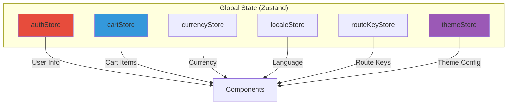

### Store Responsibilities

1. **authStore**: User authentication state, tokens, user profile
2. **cartStore**: Shopping cart items, selected services, quantities
3. **currencyStore**: Current currency selection (USD/EUR)
4. **localeStore**: Current language (en/es)
5. **routeKeyStore**: Route navigation keys
6. **themeStore**: Theme configuration, dark mode, colors

## Development Workflow

### Development Setup
```bash
# Install dependencies
npm install

# Start development server (frontend)
npm run dev

# Start backend server
cd backend
npm install
npm start

# Run linters
npm run lint

# Format code
npm run format

# Build for production
npm run build
```

### Available Scripts
- `npm run dev` - Start Vite dev server (frontend)
- `npm run build` - Build for production
- `npm run preview` - Preview production build
- `npm run lint` - Run ESLint
- `npm run lint:fix` - Fix ESLint issues
- `npm run lint:backend` - Lint backend code
- `npm run prettier` - Check code formatting
- `npm run prettier:fix` - Fix code formatting
- `npm run format` - Format and lint code

## Security Features

### Agent Proxy Security
- Host allowlist enforcement
- Request body size limits (256KB)
- Response size limits (2MB for non-stream)
- Authorization header redaction in logs
- Timeout protection (60s default)
- Method restriction (GET, POST only)
- Header allowlist (Accept, Content-Type, Authorization)

### Authentication Security
- Firebase authentication
- JWT token validation
- Protected route guards
- Role-based access control (RBAC)
- Secure session management

## Future Integrations (Planned)

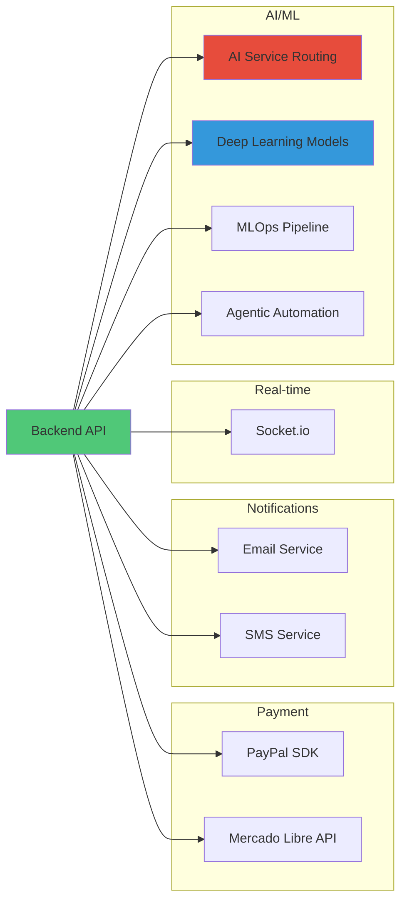

## Conclusion

This document provides a comprehensive overview of the RepairPro application structure. The application follows a modern architecture with clear separation of concerns:

- **Frontend**: Component-based React architecture with TypeScript
- **Backend**: RESTful API with Express and Node.js
- **State Management**: Centralized with Zustand
- **Styling**: Utility-first with Tailwind CSS
- **Internationalization**: i18next for multi-language support
- **Maps**: Leaflet for worker location tracking
- **Authentication**: Firebase integration with RBAC

The modular structure allows for easy maintenance, testing, and future feature additions.
